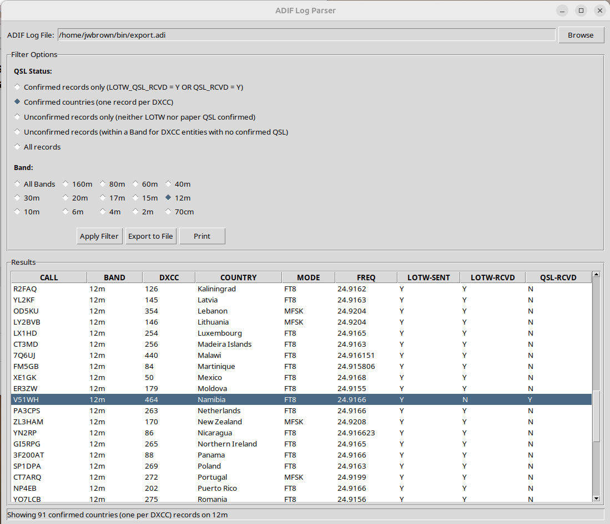

This program, LogParser.py,  will parse a ham radio log file in the ADI format to show logged but unconfirmed contacts in a particular band. The list maybe printed or saved to a file. It requires python3 and tkinter for the visual interface.

QLog running in Ubuntu 24.04 created the log file.

This helps in following up with amateur operators to see if your contact is in their log and request confirmation.

The program is known to run in 24.04 Ubuntu.

Put the the program your home/bin directory, make it executable, in terminal window, cd ~/bin and run it with: 

./LogParser.py

It is particularly useful in listing DXCC countries within a particular band that are not confirmed so that you can seek confirmation.

This version of the program added a confirmation for received paper QSL cards, which is entered in QLog. The only country so far in 12m with a paper QSL card is Namibia (highlighted) where the listing shows QSL-RCVD = Y. This is useful information because ARRL's Logbook Of The World (LOTW) shows only electronic log confirmations. The program now keeps track of total confirmations, electronic OR paper.
